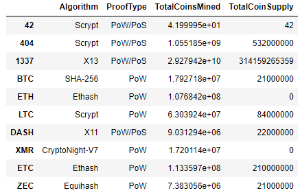
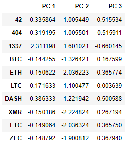
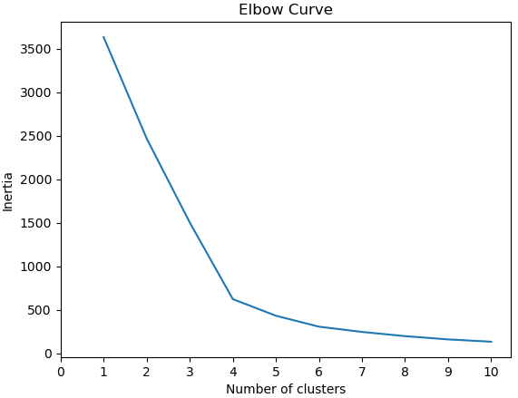
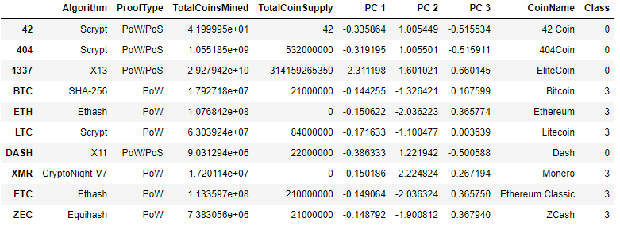
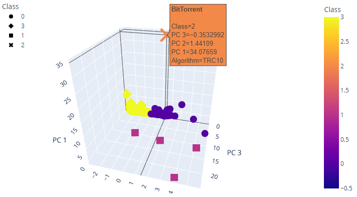
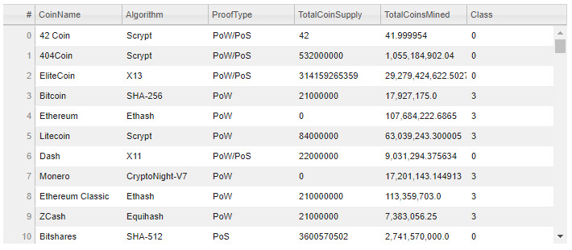
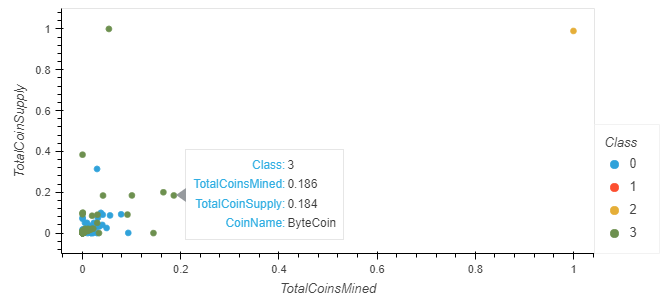

# Unsupervised Machine Learning to Group Cryptocurrencies

## Overview of Cryptocurrency Grouping
In this challenge assignment, Martha is a senior manager for the Advisory Services Team at Accountability Accounting, which is a prominent investment bank interested in offering a new cryptocurrency investment portfolio for its customers. However, AA doesn't know much about cryptocurrencies, but they have a spreadsheet of many different cryptocurrencies and some basic information about them (name, algorithm, whether or not they are being traded, proof type, total coins minted, and total possible coin supply). They have tasked us with taking this data set and finding some way to separate them into groups and classify them--a perfect task for unsupervised machine learning. However, the dataset is a little dirty and will require some pre-processing to clean it up before a clustering algorithm can be deployed. Finally, some visualizations will be created to share the results. The deliverables are as follows:

- **Deliverable 1: Preprocess the Data for PCA** 
- **Deliverable 2: Reduce Data Dimensions Using PCA** 
- **Deliverable 3: Cluster Cryptocurrencies Using K-means**
- **Deliverable 4: Visualize Cryptocurrencies Results**

## Resources
- Data Source: [crypto_data.csv](data/crypto_data.csv)
- Language(s): Python
- Application(s): Jupyter Notebook
- Final Script: [crypto_clustering.ipynb](crypto_clustering.ipynb)

## Deliverable 1: Preprocess the Data for PCA
The data were pre-processed according to the following steps:

1. Read in the `crypto_data.csv` to the Pandas DataFrame named `crypto_df`.
2. Keep all the cryptocurrencies that are being traded.
3. Drop the `IsTrading` column.
4. Remove rows that have at least one null value.
5. Filter the `crypto_df` DataFrame so it only has rows where coins have been mined.
6. Create a new DataFrame that holds only the cryptocurrency names, and use the `crypto_df` DataFrame index as the index for this new DataFrame.
7. Remove the `CoinName` column from the `crypto_df` DataFrame since it's not going to be used on the clustering algorithm.
8. Use the `get_dummies()` method to create variables for the two text features, `Algorithm` and `ProofType`, and store the resulting data in a new DataFrame named `X`.
9. Use the StandardScaler `fit_transform()` function to standardize the features from the `X` DataFrame.

The cleaned/pre-processed dataframe can be seen here:

## Deliverable 2: Reduce Data Dimensions Using PCA
The data dimensions were reduced using PCA according to the following steps:

1. Apply PCA to reduce the dimensions to three principal components
2. Create a new DataFrame named `pcs_df` that includes the following columns, `PC 1`, `PC 2`, and `PC 3`, and uses the index of the `crypto_df` DataFrame as the index.

The DataFrame with dimension-reduced variables can be seen here:

## Deliverable 3: Cluster Cryptocurrencies Using K-means
An elbow curve was created to find the best value of K for the K-means algorithm, which was then used to predict the clusters according to the following steps:

1. Using the `pcs_df` DataFrame, create an elbow curve using `hvPlot` to find the best value for K.
2. Use the `pcs_df` DataFrame to run the K-means algorithm to make predictions of the K clusters for the cryptocurrencies' data.
3. Create a new DataFrame named `clustered_df` by concatenating the `crypto_df` and `pcs_df` DataFrames on the same columns. The index should be the same as the `crypto_df` DataFrame.
4. Add the `CoinName` column that holds the names of the cryptocurrencies to the `clustered_df`.
5. Add another new column to the `clustered_df` named `Class` that holds the predictions, i.e., `model.labels_`.

The elbow curve can be seen here:

The DataFrame containing the predicted cluster for each cryptocurrency can be seen here:

## Deliverable 4: Visualize Cryptocurrencies Results
Two plots and a table were created to help visualize the clustered data according to the following steps:

1. Create a 3D scatter plot using the Plotly Express `scatter_3d()` function to plot the three clusters from the `clustered_df` DataFrame.
2. Add the `CoinName` and `Algorithm` columns to the `hover_name` and `hover_data` parameters, respectively, so each data point shows the `CoinName` and `Algorithm` on hover.
3. Create a table with tradable cryptocurrencies using the `hvplot.table()` function.
4. Print the total number of tradable cryptocurrencies in the `clustered_df` DataFrame.
5. Use the `MinMaxScaler().fit_transform` method to scale the `TotalCoinSupply` and `TotalCoinsMined` columns between the given range of zero and one.
6. Create a new DataFrame using the `clustered_df` DataFrame index that contains the scaled data created previously.
7. Add the `CoinName` column from the `clustered_df` DataFrame to the new DataFrame.
8. Add the `Class` column from the `clustered_df` DataFrame to the new DataFrame.
9. Create an `hvplot` scatter plot with x="TotalCoinsMined", y="TotalCoinSupply", and by="Class", and have it show the `CoinName` when you hover over the the data point.

The 3D scatter plot showing the clustered cryptocurrencies can be seen here:

The interactive table containing the cryptocurrencies and their classification can be seen here:

The 2D scatter plot showing Total Coin Supply vs. Total Coins Mined for each cryptocurrency can be seen here:

